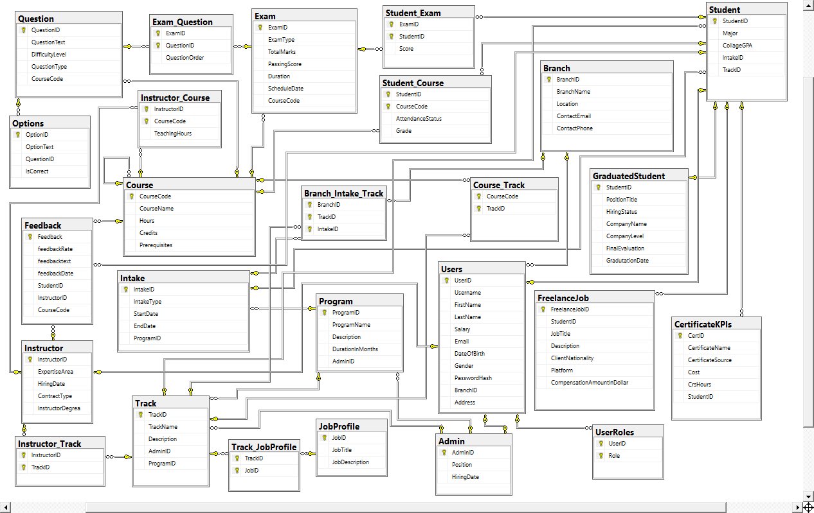
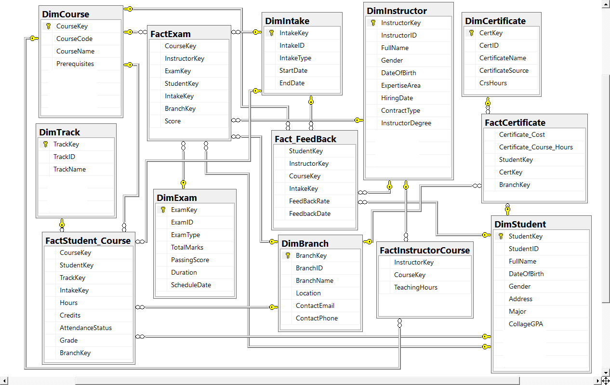
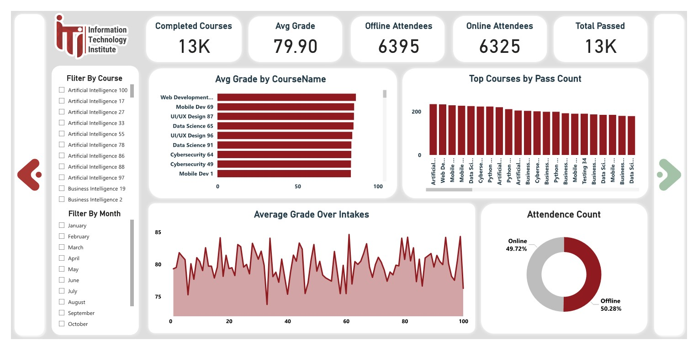

# ITI Graduation Project: Examination System

Welcome to the repository for my graduation project, which demonstrates the complete lifecycle of a data-driven application — from database design, ETL processes, and data warehouse architecture, to reporting and dashboarding, and finally the application layer.

---

## 📌 Table of Contents

- [ITI Graduation Project: Examination System](#iti-graduation-project-examination-system)
  - [📌 Table of Contents](#-table-of-contents)
  - [🚀 Project Overview](#-project-overview)
  - [🗄️ Database](#️-database)
  - [🗺️ Database Diagram](#️-database-diagram)
  - [⚙️ ETL Process (SSIS)](#️-etl-process-ssis)
  - [🏢 Data Warehouse](#-data-warehouse)
  - [📊 Reports (SSRS)](#-reports-ssrs)
  - [📈 Power BI Dashboards](#-power-bi-dashboards)
    - [20 Power BI Dashboards](#20-power-bi-dashboards)
  - [💻 Application (Flet + Node.js)](#-application-flet--nodejs)
  - [🎬 Demo](#-demo)
  - [🚀 How to Run](#-how-to-run)
  - [🛠️ Technologies](#️-technologies)
  - [👨‍💻 Author Team](#-author-team)

---

## 🚀 Project Overview

This project integrates various data engineering and application development components:
- A **relational database** with a well-designed schema.
- An **ETL pipeline** built with SSIS to perform incremental loading.
- A **data warehouse** that aggregates and organizes business data.
- **SSRS reports** for operational reporting.
- **Power BI dashboards** for business intelligence and analytics (20 dashboards in total).
- A **cross-platform application** developed using Flet (frontend) and Node.js (backend).

---

## 🗄️ Database

The project uses **SQL Server** as the primary database engine.  
It consists of well-structured tables supporting the application and reporting needs.

👉 **Main features:**
- Normalized transactional schema.
- Integrity constraints and indexing for performance.

---

## 🗺️ Database Diagram

The database design follows best practices in relational modeling.  



---

## ⚙️ ETL Process (SSIS)

- Implemented **SSIS packages** for data extraction, transformation, and loading.
- Supports **incremental loading** using staging tables.
- Ensures data quality with validation and error handling.

> 📌 *SSIS packages are available in the [`ETL`](./BI_Tools/learningManagementETL/) folder.*


---

## 🏢 Data Warehouse

A **star schema data warehouse** is designed for analytical processing, with:

- **Fact tables** (e.g. `FactExam`, `FactCertificate`, `FactStudent_Course`, `FactFeedback`)
- **Dimension tables** (e.g. `DimStudent`, `DimCourse`, `DimInstructor`, `DimTrack`)



---

## 📊 Reports (SSRS)

- Several SSRS reports designed for key operational metrics.
- Deployed to **SQL Server Reporting Services** for dynamic reporting.

> 📌 *Report definitions are included in the [`/reports`](./reports) folder.*

---

## 📈 Power BI Dashboards

- ✅ 20 interactive Power BI dashboards focusing on:
  - Student performance
  - Exam results analysis
  - Instructor effectiveness
  - Feedback trends
  - Certificate issuance metrics
  - Course completion rates

> 📌 *PBIX files are provided in the [`PBI`](./PBI) folder.*

### 20 Power BI Dashboards

<details>

<summary>Show All</summary>

- **Index**


<!-- 1. Student OverView Dashboard
2. GPA by Track and Major
3. Course Enrollment Dashboard
4. Instructor Insights
5. Branch Performance Dashboard
6. Feedback Dashboard
7. Certification Insights
8. Intake Analysis
9. Exam Performance Dashboard
10. Course Completion
11. Student Certificate Summary
12. GPA Progression over Intake
13. Student Demographics
14. Certification Insights
15. Student & course
16. Exam
17. 1nstructor Load Dashboard
18. Track Popularity Dashboard
19. Attendance Trends Dashboard
20. Summary KPI Dashboard

 -->
1. **Student OverView Dashboard**


2. **GPA by Track and Major**

3. **Course Enrollment Dashboard**

4. **Instructor Insights**

5. **Branch Performance Dashboard**

6. **Feedback Dashboard**

7. **Certification Insights**

8. **Intake Analysis**

9. **Exam Performance Dashboard**

10. **Course Completion**


11. **Student Certificate Summary**


12. **GPA Progression over Intake**


13. **Student Demographics**


14. **Certification Insights**


15. **Student & Course**


16. **Exam**


17. **Instructor Load Dashboard**


18. **Track Popularity Dashboard**


19. **Attendance Trends Dashboard**


20. **Summary KPI Dashboard**


</details>

## 💻 Application (Flet + Node.js)

- **Flet** used for building the desktop UI, supporting students, instructors, and admins.
- **Node.js** backend providing RESTful APIs, authentication, and business logic.

👉 **Features:**

- User management (students, instructors, admins)
- Exam creation and submission
- Feedback collection

> 📌 *App source code is located in the [`/app`](./app) folder.*

---

## 🎬 Demo

A full demo video of the system is available in the repo

[🎞🖥Demo Video](https://youtu.be/klFBlAdWYC8)

## 🚀 How to Run

1️⃣ Clone the repository  

```bash
git clone https://github.com/3iraqi/Examination_System-ITI.git
cd Examination_System-ITI
```

2️⃣ Set up SQL Server and restore the provided database backups.

3️⃣ Deploy SSIS packages and SSRS reports using SQL Server Data Tools.

4️⃣ Open Power BI dashboards in Power BI Desktop or publish to Power BI Service.

5️⃣ Run the Node.js backend:

```bash
cd app/backend
npm install
node server.js
```

6️⃣ Run the Flet frontend:

```bash
cd Application
flet run main.py
```

---

---

## 🛠️ Technologies

* **SQL Server** (Database + Data Warehouse + SSRS)
* **SSIS** (ETL Process)
* **Power BI**
* **Node.js**
* **Flet**
* **Python**
* **JavaScript**

---

## 👨‍💻 Author Team

- [**Mohamed Ahmed Eleraqi**](mailto:mohamed.8.eleraqi@gmail.com)

- [**Amr Elsaid Elsherbiny**]()

- [**Ahmed Nasr Mohamed**]()

- [**Mohamed Reda**]()

- [**Salema Hassan**]()

---
